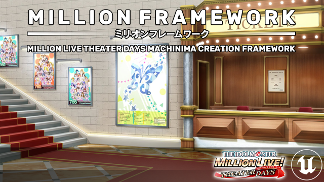

  

Million Framework is a machinima creation framework for THE iDOLM@STER Million Live Theater Days, powered by Unreal Engine 4.

## Features

*Please note that this repository is still under construction for version 0.1. Some of the feature may not present yet. [Be sure to check for the issue tracker for progress.](https://github.com/TheHoodieGuy02/Miriwaku/issues)*
 - All 58 idols, including staff, 961Pro duo, and Deremas duo
 - Flexible idol spawner, which includes its own host of features:
	 - Automated casual outfit picker:
		 Set the idol name, and the default outfits will be chosen.
	 - On-the-fly outfit switching:
		 Pick the other outfit for the idol to wear, even those that they don't wear in-game!
	 - Height and bust size adjustment, with presets in each idols. (Only applicable with SR and wildcard outfits. Does not work with casual nor SSR outfits)
- Pose and animate the idols without leaving the editor
- Robust rendering and visual effect, provided by Unreal Engine 4
- Built-in reference viewer that loads any still image or image sequence, that can sync with the Sequencer!

## Installation
Million Framework is an editor-only Unreal Engine 4.26 project requires a modified UE4.26 to work properly. You can grab it here:
https://github.com/TheHoodieGuy02/UnrealEngine

If you see a 404 page, follow the steps outlined in this page first to get access to the repository:
https://www.unrealengine.com/en-US/ue4-on-github

## Social Media Links

  
